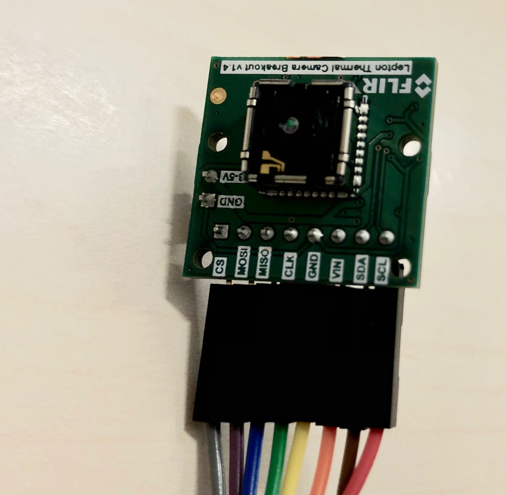
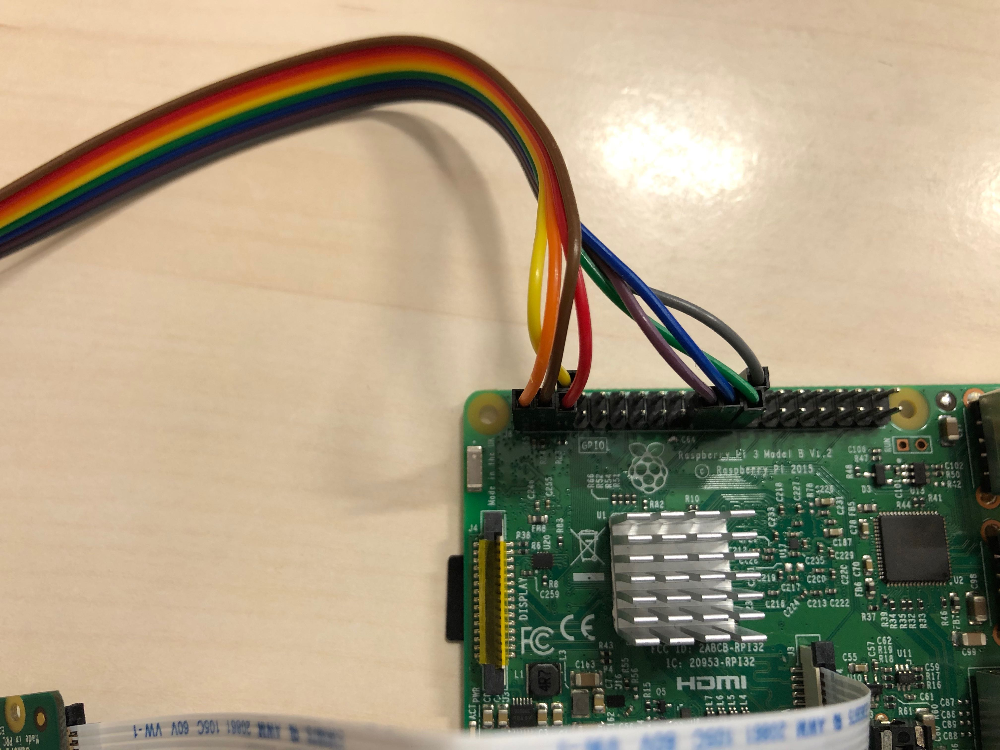
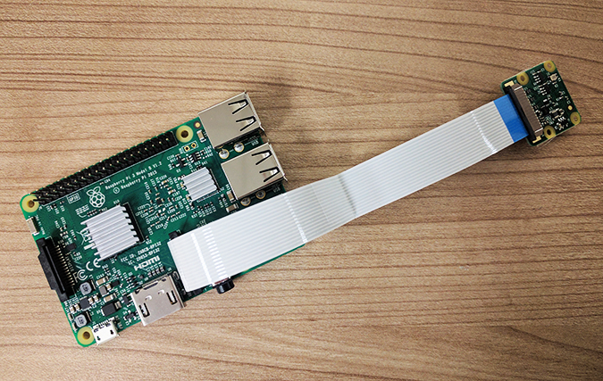
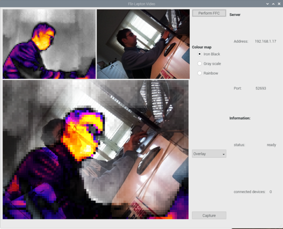
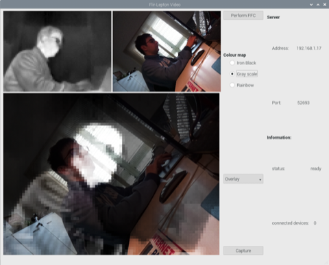
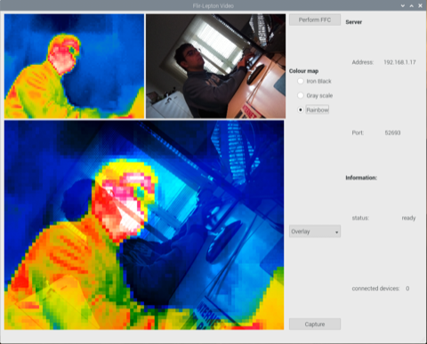

# Flir-Lepton

This Qt-based project allows the interface between the Flir Lepton 2.5 camera and Raspicam to be part of my thesis project for the Master's Degree in Mechatronics, by title _Enanching UAV capabilities with machine learning on board_.

## Prerequisites

* Qt
* gcc 6.3 (c++14 or above)
* cmake (3.7 or above)
* Flir Lepton Guide [product page](https://learn.sparkfun.com/tutorials/flir-lepton-hookup-guide)
    +   Lepton Flir 2.0 [reference](https://groupgets.com/manufacturers/flir/products/lepton-2-0)
* [RaspiCam](https://www.uco.es/investiga/grupos/ava/node/40): C++ API for using Raspberry
    + Raspicam [source](https://sourceforge.net/projects/raspicam/files/?)

### Configuration

Connections: 
1.  match your female to female jumpers wires to the images below (_note: your jumper wires may differ in color_), You can also use the list below.

<center>

| Raspberry GPIO  | Breakout Board |
|:----------------|-----------------:|
|(Pin 1) +3.3V| VIN|
|(Pin 3) SDA | SDA|
|(Pin5) SCL  |  SCL|
|(Pin6) GND |GND|
|(Pin 19)MOSI |MOSI|
|(Pin 21) MISO| MISO|
|(Pin 23) SCLK  |  CLK|
|(Pin 24) CE0 |CS|

</center>
<br>
<div class="row" align="center">
    <div class="column">    
        
    </div>
    <div class="column">
        
    </div>
</div>

2. Now install the Raspberry Pi Camera, the camera should face towards the IO ports.
<br>
<div class="row" align="center">
    <div class="column">    
        
    </div>
</div>

This configuration works well and avoids the red rectangle on the screen most of the time.
* I preferred a method that would automatically decide whether to use:  _"/dev/spidev0.1" or "/dev/spidev0.1"_

## Run 

To run the project in release mode:

```sh
git clone https://github.com/frank1789/Flir-Lepton.git
cd Flir-Lepton
./build 
```

otherwise in debug mode:

```sh
git clone https://github.com/frank1789/Flir-Lepton.git
cd Flir-Lepton
./build Debug
```

The software has a single main window in which the images acquired by the thermal camera and Raspicam are displayed.
you can edit the color map for the thermal image from the main widget and save photos.
it is possible to modify the fusion filter between the images, these however require that the cameras are perfectly aligned with a support structure.

Inside there is a TCP server to send images to clients connected using the default port 52693, while the address is shown in the main widget.

<div class="row" align="center">
    <div class="column">    
        
    </div>
    <div class="column">
        
    </div>
    <div class="column">
        
    </div>
</div>